# ReadingTracker

A web application for tracking personal reading progress across books — what you're reading, how far you've gotten, and your history of reading activity.

Built as a portfolio project, with the weight on the back end: several small services, real integration tests against real infrastructure, and architectural decisions written down rather than implied.

## Status

**Catalog**, **Library**, the **Gateway** and **Web** are built. A reader signs in, finds a book, puts it on their shelf, records what they read, and watches their progress move — end to end, through the real services.

| Service | What it does | Status |
| --- | --- | --- |
| Catalog | Finds books via Google Books and Open Library, caches them, gives them stable ids | Built |
| Library | A reader's own books: reading status, progress, and reading history | Built |
| Gateway | Single entry point; verifies the caller's token and names the reader | Built |
| Web | Blazor WebAssembly front end: the shelf, and everything a reader does to it | Built |
| Identity | Maps a Google account to an internal reader | Designed |

On the shelf, each book carries its reading status, a progress bar derived from what the reader has actually logged, and — behind one click each — reading history, the reader's own page count and tracking method, and removal. Progress is never stored: Library works it out from the latest ReadingSession every time it is asked, so the number and the history behind it cannot disagree.

> **Everything through the Gateway now needs a verified token.** It verifies the token against Google's published keys, discards whatever `X-Reader-Id` the caller sent, and sets that header itself from the token's subject. `/health` is the only route that answers without one. Locally you sign in without a Google account at all — see [Signing in locally](#signing-in-locally-without-a-google-account).

## What it looks like

The shelf, grouped by status with what is being read at the top, and the year's goal in the header:

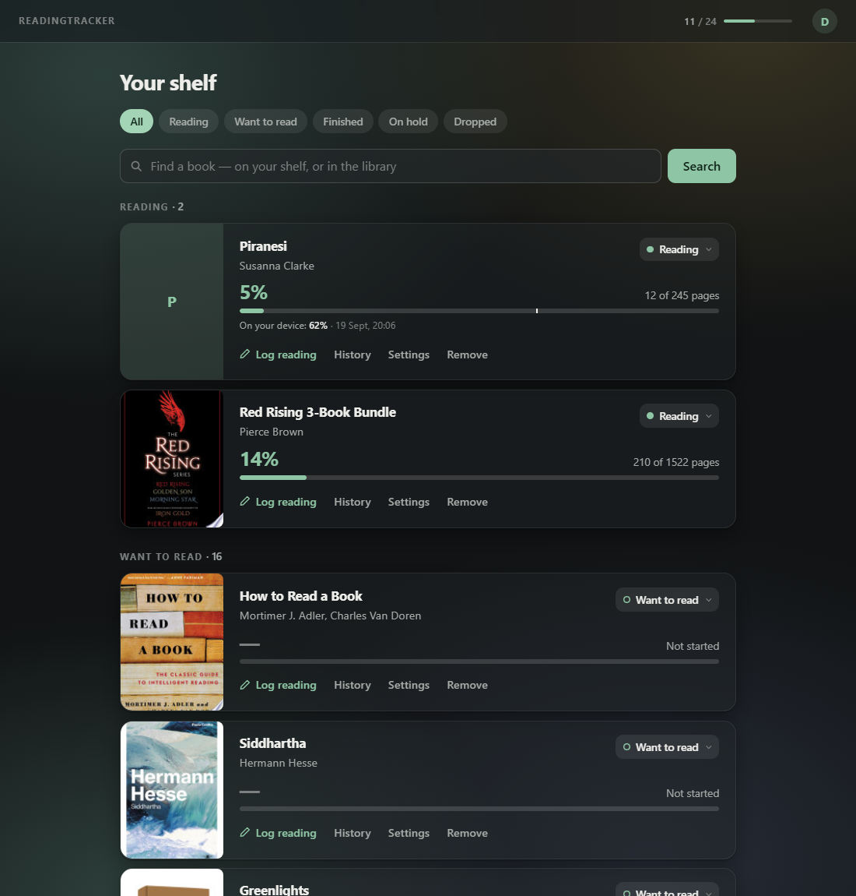

Logging a session is one form on the card — say where you stopped — and the sessions behind the bar are a click away:

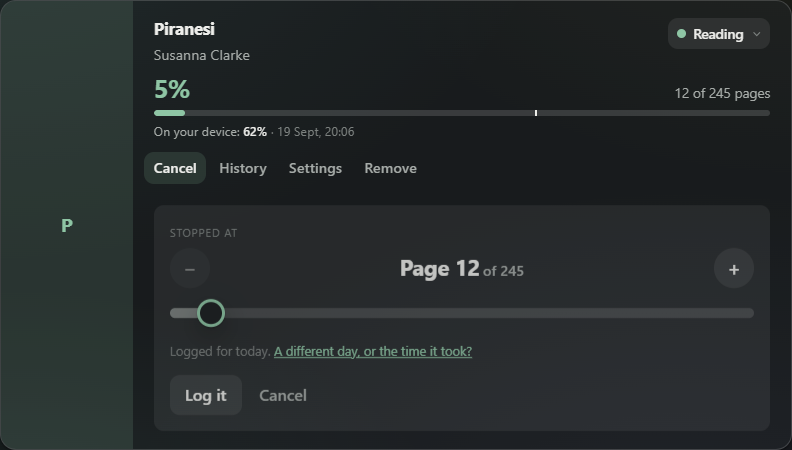

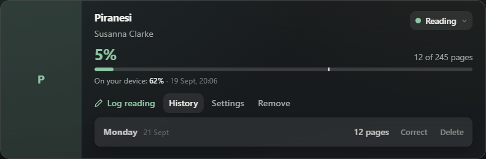

Finished books say when, and sit in that order; the year's goal opens from the header:

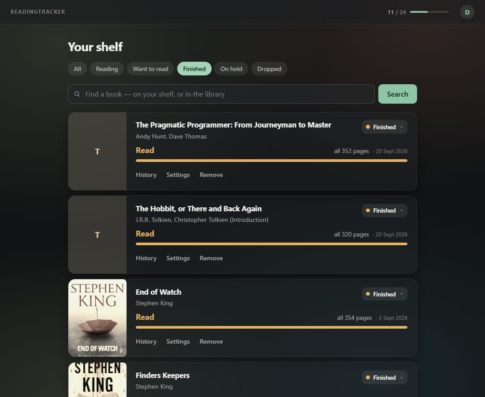

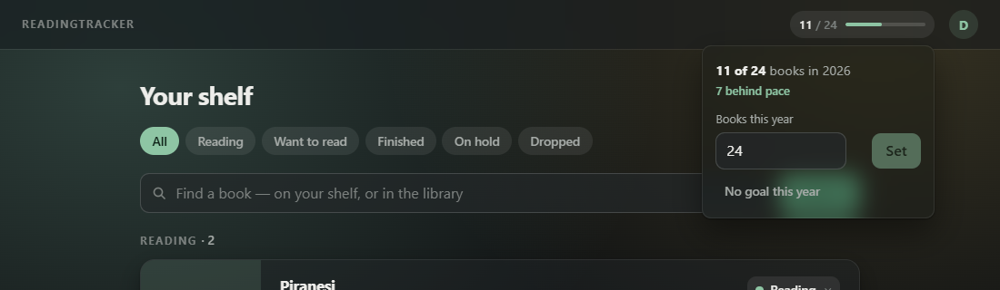

A device token puts an e-reader on the shelf without a Google sign-in — the [KOReader plugin](readingtracker.koplugin/) syncs progress from the device — and a Hardcover export lands in one go:

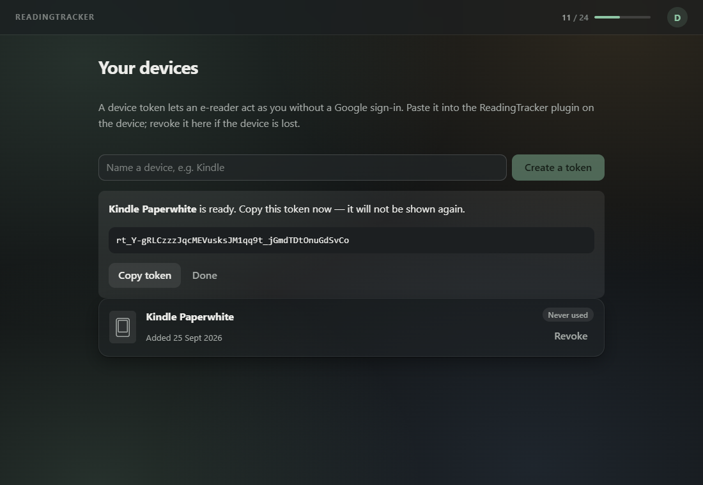

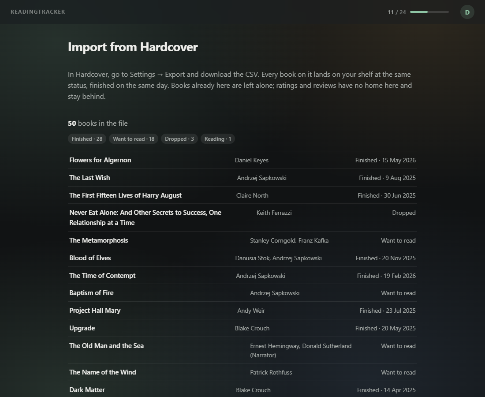

On a phone the status tabs become an underlined strip, and the shelf swipes through them. The list follows the finger and, let go far enough (or flicked), slides away while the next tab's list comes in from the other side; each tab gives the page a shade of its own. At the ends, where there is no tab to go to, the list gives only a little and springs back, as does a drag too short to mean anything:

<p>
  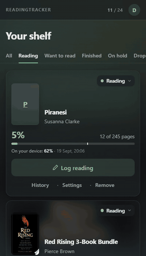
  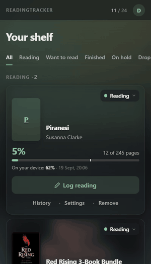
</p>

<p>
  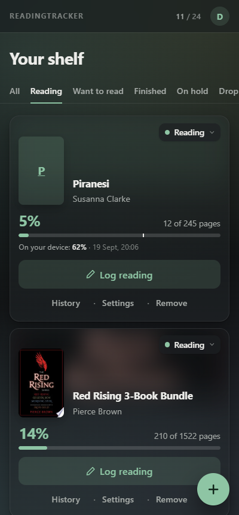
  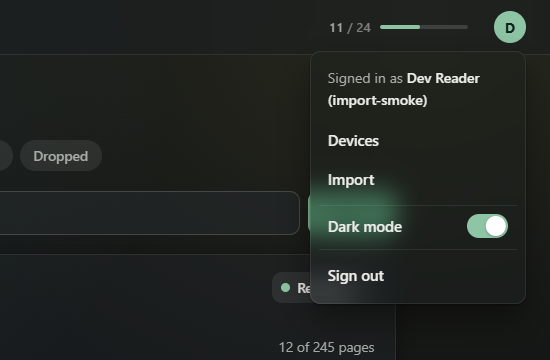
</p>

Signed out, the welcome page keeps a reader company with a quote:

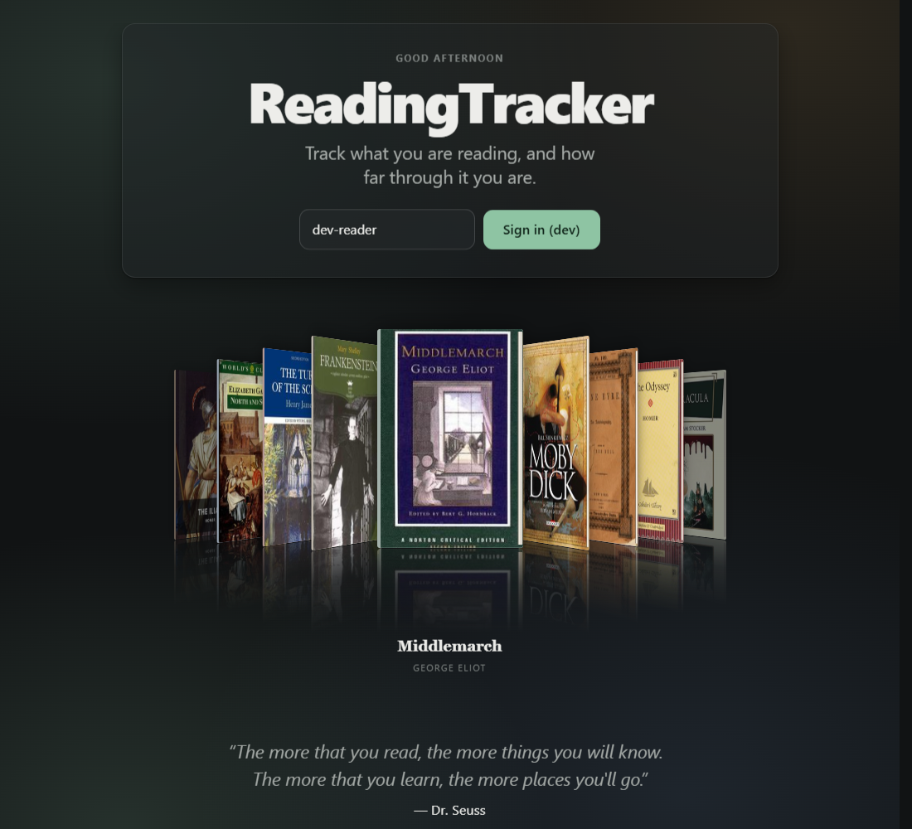

The pictures are of a local run with the dev sign-in; the token shown was revoked as soon as the picture was taken.

## Running it locally

**Prerequisites:** [.NET 10 SDK](https://dotnet.microsoft.com/download) and Docker.

```bash
# 1. Start Postgres and RabbitMQ
docker compose up -d

# 2. Configure the Google Books API key (see below)
cp .env.example .env   # then fill in GOOGLE_BOOKS_API_KEY

# 3. Run the services, each in its own terminal
dotnet run --project src/ReadingTracker.Catalog   # http://localhost:5103
dotnet run --project src/ReadingTracker.Library   # http://localhost:5110
dotnet run --project src/ReadingTracker.Gateway   # http://localhost:5100
dotnet run --project src/ReadingTracker.Web       # http://localhost:5200
```

> **Port 5200 is not arbitrary.** It is the JavaScript origin registered with this project's Google OAuth client, and sign-in fails from anywhere else. The same goes for the redirect path `/authentication/login-callback`.

**Or, all four services in one command:**

```bash
docker compose --profile services up --build
```

This still starts Postgres and RabbitMQ — `--profile services` adds the four .NET services on top, each in its own container, each still on the ports above. `--build` picks up code changes; drop it once the images already reflect what you're running. Plain `docker compose up` (no profile) stays exactly what it has always been — Postgres and RabbitMQ only — because container rebuilds are slower than `dotnet run`'s edit/rebuild loop, and the four containers would just be in the way while actively changing one service's code.

### Signing in locally, without a Google account

Run either way above and Web greets you with a **reader id box and a "Sign in (dev)" button**, not
Google. Type any reader id — `ada`, `dev-reader`, anything — and you are that reader: your own
shelf, your own entries, invisible to every other reader. Sign out and back in as someone else to
watch that hold. Nobody needs a Google account, and nothing touches a real one.

This is on because both halves opt in, and both are local-only. The Gateway mints these tokens only
when it is in the Development environment *and* `DevSignIn:Enabled` is set (ADR-0008) — `dotnet run`
and `docker compose` each set both. Web swaps Google's sign-in out for it only when served in the
Development environment, via `wwwroot/appsettings.Development.json` (ADR-0009). Neither condition
can hold in a deployed environment, and neither works without the other.

Two things follow from tokens being minted per Gateway process:

- **Restarting the Gateway invalidates the token your browser is holding** — its signing key is
  generated fresh every start and never written down. Web notices the `401`, mints a replacement
  and retries, so in practice a restart is invisible. You do not need to sign in again.
- **To drive the API by hand**, get a token the same way Web does:

  ```bash
  TOKEN=$(curl -s -X POST http://localhost:5100/dev/sign-in \
    -H 'Content-Type: application/json' -d '{"readerId":"ada"}' | jq -r .idToken)

  curl http://localhost:5100/api/library -H "Authorization: Bearer $TOKEN"
  ```

**To exercise the real Google sign-in instead**, set `DevSignIn.Enabled` to `false` in
`src/ReadingTracker.Web/wwwroot/appsettings.Development.json`. The two are alternatives — with dev
sign-in on, Google's OIDC stack is not registered at all, which is the point of it being a switch.

The OAuth client is in Google's *Testing* status, so only accounts added as test users can sign in, and Google shows an "unverified app" warning first. Both are expected. Publishing needs a public home page, privacy policy and terms of service on a verified domain, which is deployment-time work.

With the Gateway up, one address reaches everything: `/api/books/…` goes to Catalog and `/api/library/…` to Library — but only with a token it has verified, so `curl` alone gets you a `401`. Sign in through Web, or mint a dev token as above, to see it work.

Web talks to the Gateway across origins, so the Gateway only answers requests from Web's own origin — `AllowedOrigins` in its configuration — rather than from anywhere. Web itself never talks to Catalog or Library directly; it only knows the Gateway's address.

Web sends the **ID token** Google issued at sign-in, not an access token: Google's *Web application* OAuth client type cannot complete the authorisation-code exchange from a public client such as a browser (there is no client secret to send, and Google — unlike most OIDC providers — has no PKCE-only exception for this client type), so sign-in uses the implicit `id_token` flow instead. That token is also exactly what the Gateway needs, since ADR-0001 has it validating ID tokens.

The two services can still be called directly on their own ports, which is how you drive them by hand locally. That is exactly what must be impossible once deployed: anything that can reach them directly can claim to be any reader by setting a header. See ADR-0007.

Each service exposes `/health`, and each returns `Healthy` only when it can actually reach its own database. Catalog, Library and the Gateway share one Postgres instance but own separate schemas and never read each other's tables; the Gateway's holds DeviceTokens and nothing else (ADR-0014).

> **Ports.** Postgres is on **55432** and RabbitMQ on **55672** (management UI on **55673**), deliberately off the default ports so they don't collide with anything already installed locally.

### The Google Books API key

You need one. Google quotas *keyless* access to the Books API at **zero** requests per day, so book search cannot reach the live API without a key.

1. Create a project at [console.cloud.google.com](https://console.cloud.google.com/).
2. Enable the [Books API](https://console.cloud.google.com/apis/library/books.googleapis.com).
3. **APIs & Services → Credentials → Create credentials → API key**.
4. Put it in `.env` as `GOOGLE_BOOKS_API_KEY`.

`.env` is gitignored. Deployed environments supply configuration directly rather than through a file. Open Library needs no key and is used as a fallback.

## The Catalog API

| Endpoint | Purpose |
| --- | --- |
| `GET /health` | Healthy only when the database is reachable |
| `GET /api/books/search?isbn=` | Find a specific edition |
| `GET /api/books/search?title=&author=` | Find candidates; author narrows the search |
| `GET /api/books/{bookId}` | Read a stored book |
| `POST /api/books` | Add a book by hand when no provider has it |

Search consults Google Books first, then Open Library. Three outcomes are deliberately distinct:

- **`200` with results** — found.
- **`200` with an empty list** — the providers answered, and nobody has this book.
- **`503`** — no provider could be reached, so we genuinely don't know. Reporting "no results" here would tell you a book doesn't exist when we simply couldn't ask.

Books are cached the first time they're referenced, so repeat lookups don't hit a provider again, and every book gets a stable id that other services can point at. Storing a new book publishes a `BookCached` event to RabbitMQ.

## Tests

```bash
dotnet test
```

Integration tests boot the real application in-process against a throwaway Postgres and RabbitMQ (via Testcontainers), and drive it over HTTP rather than reaching into internals. External book providers are stubbed at the network boundary, so the real provider code — including how it parses each provider's JSON — runs under test while no test ever touches the live APIs.

Docker must be running.

### Building and testing before each commit

There is a pre-commit hook that runs the same build and tests, so a broken build is caught locally
rather than in CI several minutes later. It is opt-in per clone — git will not run a hook out of a
tracked directory unless you point it there:

```bash
git config core.hooksPath .githooks
```

It skips documentation-only commits, and `git commit --no-verify` bypasses it for a work-in-progress
commit. It builds into `artifacts/` rather than `bin/`, so it neither fights a locally running
service for its own assemblies nor disturbs your incremental build state.

CI still runs build and test on every PR regardless — the hook is the fast local echo of it, not a
replacement.

### A restore that fails on a vulnerable package

`Directory.Build.props` turns NuGet's audit on for every project and makes a high or critical
advisory — on a package referenced directly or pulled in transitively — a restore *error*
(`NU1903`, `NU1904`). So a restore can fail, locally or in CI, on a commit that changed nothing:
an advisory was published against something already in use. That is the gate doing its job. The
fix is to move to the patched version (`dotnet list package --vulnerable --include-transitive`
names it), and Dependabot usually has the pull request for it open already — it watches the NuGet
packages, the Dockerfiles' base images and the workflows' Actions weekly.

## Design documentation

- [`CONTEXT.md`](./CONTEXT.md) — the domain glossary. Worth reading first: it defines `Book`, `LibraryEntry`, `ReadingSession`, `ReadingStatus` and `TrackingMethod`, and is deliberately free of implementation detail.
- [`docs/adr/`](./docs/adr/) — architectural decisions and, more usefully, why the alternatives were rejected.
